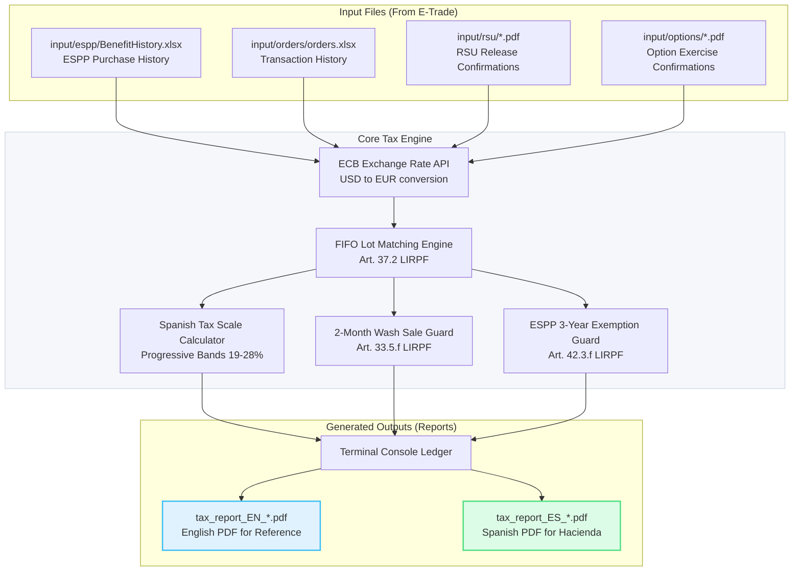

# Teammate's Guide: E-Trade Spanish Tax Calculator


Welcome to the **Spanish FIFO Tax Calculator** for E-Trade. This repository contains a customized CLI engine designed to process your E-Trade transaction history (RSUs, ESPPs, Stock Options) and compute your Spanish tax liabilities according to the rules of the Spanish Tax Agency (*Agencia Tributaria - Hacienda*).

This guide helps teammates and colleagues understand how the tool works, how to prepare files, and how to run it.

---

## 1. High-Level System Architecture & Data Flow

Here is how data flows through the calculator:



---

## 2. Core Features (Spanish Tax Logic)

The calculator automatically handles the complex Spanish tax rules that standard US platforms (like E-Trade) do not calculate for you:

1. **Strict FIFO Matching:** Spanish law matches stock sales against your oldest purchases/vests first (**Art. 37.2 LIRPF**), ignoring any custom lot selection you chose in E-Trade's UI.
2. **ECB Currency Conversion:** Converts all acquisition and sale prices to EUR using the official European Central Bank rate on the exact transaction date.
3. **2-Month Wash Sale Rule:** Blocks/defers capital losses from being declared if you purchased or vested replacement shares within a window of 2 months before or after the sale date (**Art. 33.5.f LIRPF**).
4. **ESPP Early Sale Warnings:** Detects if ESPP shares were sold before the 3-year holding mark. If so, it flags the discount as taxable salary income (*Rendimiento del Trabajo*) in the year of purchase (**Art. 42.3.f LIRPF**).
5. **Fee Deductions:** Deducts inherent E-Trade commissions and SEC fees from your capital gains to lower your tax bill (**Art. 35 LIRPF**). Wire-transfer fees are **excluded** by default.

---

## 3. Quick Start: How to Run the Calculator

To run the engine, follow these simple steps:

### Step 1: Export your E-Trade Data
1. **Excel Orders History:**
   * Go to E-Trade ➔ **Portfolios** ➔ **Transactions**.
   * Download your complete transaction history as an Excel file, save it as `orders.xlsx`, and place it in the `input/orders/` directory. The ESPP purchase history (`BenefitHistory.xlsx`) goes in `input/espp/`.
2. **RSU Confirmation PDFs:**
   * Go to E-Trade ➔ **Documents** ➔ **Confirmations**.
   * Download the PDF confirmations for all your RSU releases (vesting events), place them in the `input/rsu/` directory.
3. **Option Exercise Confirmations (If applicable):**
   * Download the exercise confirmation PDFs and place them in the `input/options/` directory.

### Step 2: Organize the Files
Ensure your project folder structure looks like this:
```text
tax-etrade/
├── input/
│   ├── espp/
│   │   └── BenefitHistory.xlsx
│   ├── orders/
│   │   └── orders.xlsx
│   ├── rsu/
│   │   ├── rsu_release_1.pdf
│   │   └── rsu_release_2.pdf
│   ├── options/
│   │   └── option_exercise_1.pdf
│   ├── prior_losses.json   # optional: pending losses from before your data window
│   └── savings_income.json # optional: dividends/interest per year (EUR)
```

### Step 3: Run the Script
The project includes self-executable scripts that automatically bootstrap the virtual environment and dependencies. You do not need to install python packages manually.

* **On macOS:**
  * Double-click [run_tax_engine.command](file:///Users/manu.lopez/tax-etrade/run_tax_engine.command) in Finder, or run `./run_tax_engine.command` in your terminal.
* **On Windows:**
  * Double-click [run_tax_engine.bat](file:///Users/manu.lopez/tax-etrade/run_tax_engine.bat).

---

## 4. Understanding the Outputs

Once the execution finishes, the tool produces the following results:

1. **Console Report:** A detailed terminal breakdown of each sale, FIFO lot match, wash-sale blocks, and yearly tax summaries.
2. **PDF Reports:** Bilingual PDF files generated directly in your root folder:
   * `tax_report_EN_*.pdf`: English reference report.
   * `tax_report_ES_*.pdf`: Spanish report formatted specifically to show to **Hacienda** or your **Asesor Fiscal** (tax advisor).

---

## 5. Important Reminders & Limitations

* **Loss Carryforward:** The report includes a **Loss Carryforward Ledger** that simulates the 4-year offset of net losses against later gains across the tracked years (Art. 49 LIRPF) and flags losses that expire unused. To seed losses from *before* your data window, add `input/prior_losses.json` (e.g. `{"2019": 1500, "2020": 300}`) or pass `--prior-losses <file>`. Cross-category offset against other savings income (dividends, interest) is still applied by your advisor at filing time.
* **Modelo 100 Guide:** The report includes a crosswalk mapping each figure to its Modelo 100 *apartado*. Casilla numbers are indicative — verify them for your filing year.
* **Single Ticker Limit:** The engine assumes all transactions correspond to a single company stock (e.g. your employer's stock). 
* **Modelo 720:** If your foreign stock value exceeds €50,000, you must file Modelo 720 separately. The engine does not automate this.
