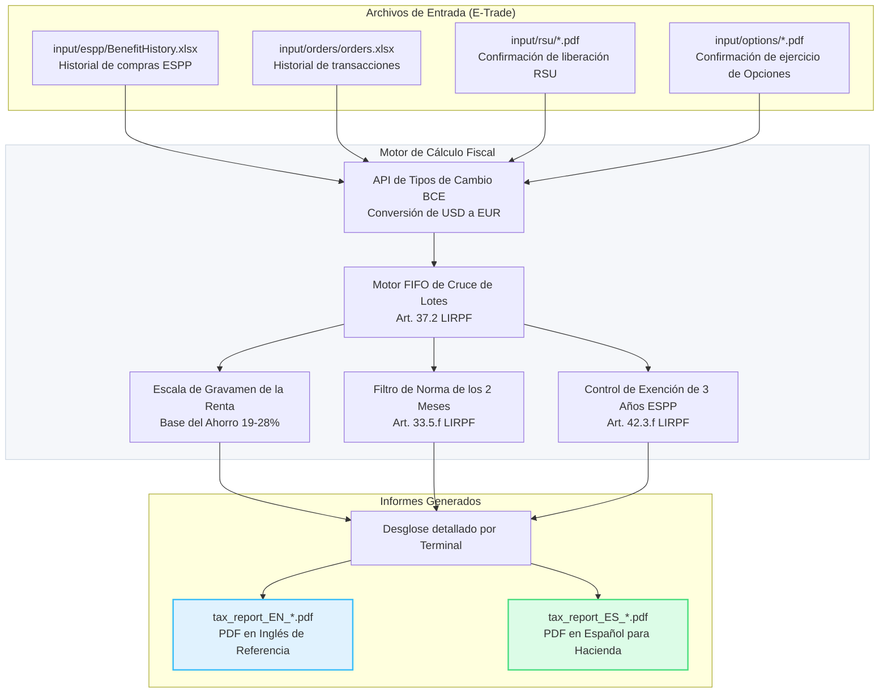

# Guía para el Equipo: Calculadora Fiscal E-Trade (FIFO España)


Bienvenido a la **Calculadora Fiscal FIFO de España** para E-Trade. Este repositorio contiene un motor por línea de comandos (CLI) personalizado y diseñado para procesar tu historial de transacciones de E-Trade (RSUs, ESPPs, Stock Options) y calcular tus obligaciones tributarias en España de acuerdo con las normas de la **Agencia Tributaria (Hacienda)**.

Esta guía ayudará a los compañeros de equipo y colegas a entender cómo funciona la herramienta, cómo preparar los archivos y cómo ejecutarla.

---

## 1. Arquitectura del Sistema y Flujo de Datos

Así es como fluyen los datos a través de la calculadora:



---

## 2. Características Principales (Lógica Fiscal Española)

La calculadora resuelve de forma automática las reglas fiscales complejas españolas que las plataformas americanas (como E-Trade) no calculan por defecto:

1. **Cruce Estricto por FIFO:** La ley española exige que las ventas de acciones se crucen con tus compras o liberaciones más antiguas primero (**Art. 37.2 LIRPF**), ignorando cualquier lote específico que selecciones en la web de E-Trade.
2. **Conversión de Divisa Oficial (BCE):** Convierte todos los costes de adquisición y precios de venta a EUR utilizando el tipo de cambio oficial del Banco Central Europeo de la fecha exacta de cada operación.
3. **Regla de los 2 Meses (Wash Sales):** Bloquea/difiere las pérdidas patrimoniales en la declaración si compraste o recibiste acciones homogéneas en el periodo de 2 meses anteriores o posteriores a la venta con pérdidas (**Art. 33.5.f LIRPF**).
4. **Ventas Anticipadas de ESPP:** Detecta si vendiste acciones de ESPP antes de cumplir los 3 años de tenencia obligatoria. Si es así, clasifica el descuento de compra como rendimiento del trabajo tributable en el año de adquisición (**Art. 42.3.f LIRPF**).
5. **Deducción de Gastos:** Deduce las comisiones inherentes a las ventas y las SEC fees del total de tus ganancias para reducir tu cuota tributaria (**Art. 35 LIRPF**). Las comisiones bancarias por transferencia (wire fees) se **excluyen** por defecto.

---

## 3. Guía de Inicio Rápido: Cómo Ejecutar la Calculadora

Para utilizar la herramienta, sigue estos sencillos pasos:

### Paso 1: Exportar tus Datos de E-Trade
1. **Historial de Operaciones (Excel):**
   * Ve a E-Trade ➔ **Portfolios** ➔ **Transactions**.
   * Descarga el historial completo en formato Excel, guárdalo como `orders.xlsx` e introdúcelo en la carpeta `input/orders/`. El historial de compras ESPP (`BenefitHistory.xlsx`) va en `input/espp/`.
2. **Confirmaciones de RSU (PDFs):**
   * Ve a E-Trade ➔ **Documents** ➔ **Confirmations**.
   * Descarga las confirmaciones en PDF de todas tus liberaciones de RSU (vesting events) e introdúcelas en la carpeta `input/rsu/`.
3. **Confirmaciones de Ejercicio de Opciones (PDFs, si aplica):**
   * Descarga los PDFs de confirmación de ejercicio y colócalos en `input/options/`.

### Paso 2: Organizar los Archivos
Asegúrate de que la estructura de carpetas de tu proyecto se vea así:
```text
tax-etrade/
├── input/
│   ├── espp/
│   │   └── BenefitHistory.xlsx
│   ├── orders/
│   │   └── orders.xlsx
│   ├── rsu/
│   │   ├── rsu_release_1.pdf
│   │   └── rsu_release_2.pdf
│   ├── options/
│   │   └── option_exercise_1.pdf
│   ├── prior_losses.json   # opcional: pérdidas pendientes de antes de tu ventana de datos
│   └── savings_income.json # opcional: dividendos/intereses por año (EUR)
```

### Paso 3: Ejecutar el Programa
El proyecto incluye scripts autoejecutables que configuran automáticamente el entorno virtual y las dependencias necesarias. No es necesario instalar paquetes de python de forma manual.

* **En macOS:**
  * Haz doble clic en el archivo [run_tax_engine.command](file:///Users/manu.lopez/tax-etrade/run_tax_engine.command) desde el Finder, o ejecuta `./run_tax_engine.command` en tu terminal.
* **En Windows:**
  * Haz doble clic en [run_tax_engine.bat](file:///Users/manu.lopez/tax-etrade/run_tax_engine.bat).

---

## 4. Comprensión de los Informes Generados

Cuando finaliza la ejecución, la herramienta genera:

1. **Desglose en Terminal:** Muestra en tiempo real cada venta, el cruce FIFO detallado por lotes, las pérdidas bloqueadas por la regla de los 2 meses y los resúmenes anuales.
2. **Informes PDF:** Se guardan en la raíz del proyecto:
   * `tax_report_EN_*.pdf`: Informe de referencia en inglés.
   * `tax_report_ES_*.pdf`: Informe en español con el formato y referencias legales listas para entregar a **Hacienda** o a tu **Asesor Fiscal**.

---

## 5. Recordatorios e Imprescindibles

* **Compensación de Pérdidas:** El informe incluye un **Libro de Compensación de Pérdidas** que simula la compensación a 4 años de las pérdidas netas contra ganancias posteriores entre los años analizados (Art. 49 LIRPF) y avisa de las pérdidas que caducan sin usar. Para incorporar pérdidas de *antes* de tu ventana de datos, añade `input/prior_losses.json` (p. ej. `{"2019": 1500, "2020": 300}`) o usa `--prior-losses <archivo>`. La compensación con otras rentas del ahorro (dividendos, intereses) la aplica tu asesor al presentar la declaración.
* **Guía del Modelo 100:** El informe incluye una tabla que asigna cada dato a su *apartado* del Modelo 100. Los números de casilla son orientativos — verifícalos para tu ejercicio.
* **Un Solo Valor (Ticker):** El motor asume que todas las operaciones son sobre el mismo valor (ej. acciones de tu empresa).
* **Modelo 720:** Si el saldo de tus acciones depositadas en el extranjero supera los 50.000 €, deberás presentar la declaración informativa Modelo 720. El programa no genera este modelo.
